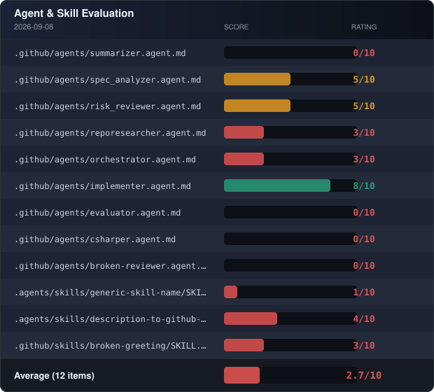

# Agentic Workshop

This repository host two workshops for getting more familiar with concepts in agentic workflows and customization.

The first part covers core concepts like creation of custom agents, skills, important aspects like limiting available tools, carefully writing instructions etc.

The second part covers more concepts in how to evaluate and how to orchestrate agents.

## Evaluation Status

> The badge is automatically updated when the [Evaluate Agents & Skills](./.github/workflows/evaluate.yml) workflow runs.

## Getting Started

To get started working on this workshop repository you should create your own copy of it using the 'use this template' button and select the 'Create a new repository' option.

### Pre-Exercise Steps

#### Ensuring Setup Success

Before starting with the workshops there's a couple of steps to take first.
When you've created the repo from the template there is a workflow that is started which sets up the respository. Go to the actions tab and verify that this succeeds.

If everything goes according to plan you should see that the repository now have several issues available and an additional label `copilot:plan-and-implement`.

If these don't exist you can create this label manually, and you can use GitHub Copilot to create the issues by invoking the `/description-to-github-issues` skill.

**Important** go to your repository
-> go to the `Settings`
-> select `Actions/General` in the left-hand menu
-> at the bottom ensure `Allow GitHub Actions to create and approve pull requests` is checked (allowed) and save

#### Familiarizing

Check out the repository locally and familiarize yourself with it.

Go to the repository on github.com and click on the `Issues` tab. Click on one of the issues and assign the `copilot:plan-and-implement` label to it.
Go to the `Actions` tab and see that this started a workflow. Follow the steps and see how this works. It will take some time, so you might want to continue with other tasks and come back later to see how it ended up and the results of the workflow.

### Exercises

The exercises part of this workshop can be found in the [/exercises](/exercises/) folder where you can find both stage 1 and 2. These are not dependant on eachother and which to use will be told by your workshop instructor.

## Repository content

You'll find this repo is prepopulated with some agent and skill definitions in the .agents, .claude and .github folders. Some of which are well defined, others less so.

Reference documentation lives in the [/docs](/docs/) folder:

- [Copilot customization overview](/docs/copilot-customization.md) — the full landscape (instructions, prompts, agents, skills, MCP) and how context is assembled
- [Agent Skills reference](/docs/skills.md) — SKILL.md anatomy, progressive disclosure, trigger tuning
- [Custom Agents reference](/docs/custom-agents.md) — frontmatter, tool restrictions, handoffs
- [Agent orchestration](/docs/agent-orchestration.md) — the GitHub Actions pipeline that turns labeled issues into reviewed PRs

There are also workflows for running on GitHub Actions that are orchestrating agents. To see more about how these workflows works see the documentation [/docs/agent-orchestration.md](./docs/agent-orchestration.md).

Included in this repo you'll find an evaluator tool, which resides in the [/evaluator](/evaluator/) folder. This tool takes a look at all the agent and skill definitions available in the directory, evaluates them with the help of AI and provides a score. It can also format the score as a badge to easily have an overview of the current situation

See the [evaluator documentation](./docs/evaluator.md) for usage, arguments, evaluation flow, and badge generation.

In this repository we aim to have an application residing in the src folder. Here you can find a description of it and functional requirements.

