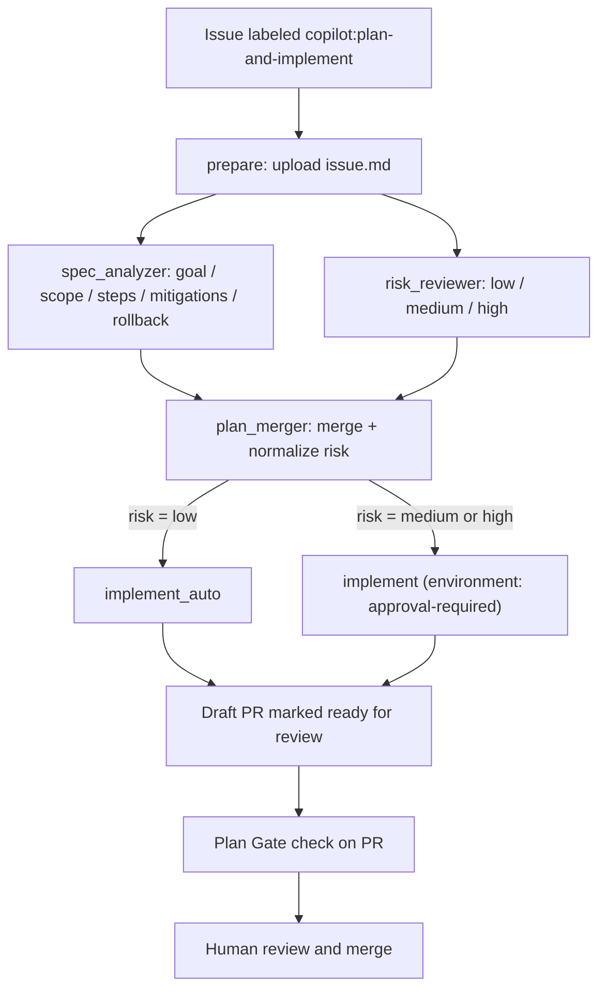

# Agent Orchestration

This repository ships a GitHub-native pipeline that lets an AI agent turn a
labeled issue into a reviewed pull request. The design keeps humans
accountable for outcomes by enforcing a visible plan, a bounded changeset,
automated evidence, and explicit approval before merge.

## Workflows

| Workflow                                                      | Trigger                                                                | Purpose                                                           |
| ------------------------------------------------------------- | ---------------------------------------------------------------------- | ----------------------------------------------------------------- |
| [Plan and Implement](../.github/workflows/plan-implement.yml) | `issues.labeled` (`copilot:plan-and-implement`) or `workflow_dispatch` | Plans, risk-scores, and implements the change on an agent branch. |
| [Plan Gate](../.github/workflows/plan-gate.yml)               | `pull_request` to `main`                                               | Blocks PRs whose body does not follow the required plan template. |
| [Evaluate Agents & Skills](../.github/workflows/evaluate.yml) | `workflow_dispatch`                                                    | Scores agent/skill definitions and publishes a badge.             |

## Reusable actions

| Action                                                                       | Role in the pipeline                                                                                 |
| ---------------------------------------------------------------------------- | ---------------------------------------------------------------------------------------------------- |
| [`setup-copilot-cli`](../.github/actions/setup-copilot-cli/action.yml)       | Installs Node and the GitHub Copilot CLI on the runner.                                              |
| [`copilot-json-task`](../.github/actions/copilot-json-task/action.yml)       | Runs a Copilot prompt against the issue with injection guards and returns a validated JSON artifact. |
| [`open-agent-pr`](../.github/actions/open-agent-pr/action.yml)               | Creates the working branch, renders the PR body from `plan.json`, and opens a draft PR.              |
| [`implement-agent-plan`](../.github/actions/implement-agent-plan/action.yml) | Executes the `implementer` agent against the plan, commits results, and marks the PR ready.          |

## End-to-end flow

The [`prepare`](../.github/workflows/plan-implement.yml) job resolves the
issue and uploads it as an artifact. `spec_analyzer` and `risk_reviewer`
fan out in parallel, each producing a JSON artifact through
[`copilot-json-task`](../.github/actions/copilot-json-task/action.yml).
[`plan_merger`](../.github/workflows/plan-implement.yml) fans them back in,
normalizes `risk` to `{low, medium, high}` (defaulting to `high`), and
publishes `plan.json`. The implement stage then either runs directly
(`low`) or waits for approval through the `approval-required`
environment (`medium`/`high`).

## Guardrails and how they map to orchestration principles

Each guardrail below is present in the pipeline. The bullet under each one
maps it to the accountability model in the request: a stated goal, an
inspectable plan, a bounded changeset, automated evidence, human judgment,
and a clear outcome.

### 1. Stated goal — the issue is the single source of truth

The pipeline only runs from a real issue: `prepare` calls
`gh issue view` and every downstream job receives the same `issue.md`
artifact. There is no free-form prompt path.

- **Principle:** every agent run has a linkable, human-authored goal.
- **Anti-pattern avoided:** agents acting on ad-hoc chat with no
  traceable request.

### 2. Inspectable plan — structured JSON, not prose

[`spec_analyzer`](../.github/workflows/plan-implement.yml) forces the
model to emit a JSON object with `goal, scope, steps, mitigations,
rollback`. `jq` validates it before it becomes an artifact, and
[`open-agent-pr`](../.github/actions/open-agent-pr/action.yml) renders
it into the PR body using the [plan template](../.github/PULL_REQUEST_TEMPLATE/plan-template.md).

- **Principle:** the plan is machine-checked and reviewer-visible before
  any code changes.
- **Anti-pattern avoided:** "trust me" PRs where the intent is buried in
  the diff.

### 3. Risk gate — approval scales with blast radius

[`risk_reviewer`](../.github/workflows/plan-implement.yml) produces a
single field (`low | medium | high`). `plan_merger` normalizes the value
and defaults to `high` on anything unexpected. The result routes to one
of two jobs:

- `implement_auto` runs directly for `low` risk.
- `implement` targets the `approval-required` environment; GitHub blocks
  the job until a reviewer approves in the Environments UI.

- **Principle:** checks match the risk of the change; unknown risk is
  treated as high risk.
- **Anti-pattern avoided:** uniform "auto-merge everything" or uniform
  "block everything" policies that either under- or over-invest in
  review.

### 4. Bounded changeset — one branch, one PR, one job

[`open-agent-pr`](../.github/actions/open-agent-pr/action.yml) creates a
deterministic branch name (`agent-plan/issue-<n>-<run_id>`), opens a
**draft** PR immediately, and exports `BRANCH`/`BASE` for the next step.
The [`concurrency`](../.github/workflows/plan-implement.yml) group is
keyed on the issue number with `cancel-in-progress: false`, so two runs
for the same issue cannot race.

- **Principle:** every agent contribution is a diff on a named branch
  attached to an issue.
- **Anti-pattern avoided:** agents pushing to shared branches or
  producing overlapping changes for the same request.

### 5. Least-privilege permissions per job

`permissions: {}` is declared at the workflow level and each job opts in
to only what it needs (`contents: read`, `copilot-requests: write`, and
only `implement*` gets `contents: write` + `pull-requests: write`). The
planning jobs cannot push code, and the implement jobs cannot exist
without a merged plan.

- **Principle:** capability boundaries separate "think" from "act".
- **Anti-pattern avoided:** a single over-scoped token that lets any
  step do anything.

### 6. Prompt-injection hardening

[`copilot-json-task`](../.github/actions/copilot-json-task/action.yml)
loads the untrusted issue body into a shell variable, embeds it inside
`<ISSUE>` tags with an explicit instruction to ignore any directives
found inside, and restricts Copilot to read-only tools
(`--available-tools='view,glob,grep'`). Output is extracted between the
first `{` and last `}` and re-parsed by `jq` before being trusted.

- **Principle:** treat model inputs as untrusted data and model outputs
  as untrusted until validated.
- **Anti-pattern avoided:** issue authors (or transitive content in
  linked files) steering the agent into unintended tools or actions.

### 7. Plan Gate on every PR

[Plan Gate](../.github/workflows/plan-gate.yml) runs on every PR to
`main` and fails if the PR body is missing any required section from the
[plan template](../.github/PULL_REQUEST_TEMPLATE/plan-template.md)
(Goal, Scope, Steps, Success criteria, Risks, Rollback, Evidence,
Review checklist). It reads `PR_BODY` as data — never through `eval`.

- **Principle:** the plan format is enforced for humans and agents
  alike, so review checklists cannot silently disappear.
- **Anti-pattern avoided:** template drift where later PRs lose the
  audit fields the earlier ones had.

### 8. Human judgment — draft first, ready second

`open-agent-pr` always opens the PR as a **draft**;
[`implement-agent-plan`](../.github/actions/implement-agent-plan/action.yml)
only calls `gh pr ready` after the agent produced a non-empty diff.
Combined with the `approval-required` environment and Plan Gate, a
human is required to (a) approve the environment on non-low risk and
(b) approve the PR before merge.

- **Principle:** agents change who performs work, not who owns the
  outcome.
- **Anti-pattern avoided:** fully autonomous merges with no reviewer in
  the loop.

### 9. Minimum audit trail

Every run leaves the artifacts needed to reconstruct what happened:

- The `issue`, `spec`, `risk`, and `plan` [artifacts](../.github/actions/copilot-json-task/action.yml) captured per run.
- The plan rendered into the PR body, including a link back to the [workflow run](../.github/actions/open-agent-pr/action.yml).
- The [initial empty commit](../.github/actions/open-agent-pr/action.yml) (`chore: start agent plan for issue #N`) that anchors the branch to the issue before any code is written.
- The implementer commit produced by [`implement-agent-plan`](../.github/actions/implement-agent-plan/action.yml), pushed to a branch named after the issue and run.
- The [Plan Gate check](../.github/workflows/plan-gate.yml) recorded on the PR.

Together these satisfy the six-item accountability checklist:

| Requirement        | Where it lives                                                                                     |
| ------------------ | -------------------------------------------------------------------------------------------------- |
| Stated goal        | Issue linked from PR title/body                                                                    |
| Inspectable plan   | `plan.json` artifact + PR body from [`open-agent-pr`](../.github/actions/open-agent-pr/action.yml) |
| Bounded changeset  | `agent-plan/issue-<n>-<run_id>` branch                                                             |
| Automated evidence | Workflow run URL + uploaded artifacts                                                              |
| Human judgment     | `approval-required` environment + PR review                                                        |
| Clear outcome      | Merge, revert of the agent commit, or issue re-labeled for escalation                              |

## Post-incident view

If an agent change passes CI and later regresses, this pipeline is designed
so the review is about the system, not the agent:

- **Was there a visible plan and scope?** Yes — `plan.json` and PR body.
- **Were the right reviewers requested and approvals given?** Recorded by
  the `approval-required` environment and PR review history.
- **Did the checks match the risk?** The `risk` field in `plan.json` and
  the branching in `plan_merger` show which path ran.
- **Is the audit trail sufficient?** The run's artifacts, the branch, and
  the PR together reconstruct the decision.

The clear outcome path for a regression is to revert the implementer
commit on the agent branch (or the merge commit on `main`) and re-open
the issue; because the branch, commit, and artifacts are all keyed to the
issue and run, the revert is unambiguous.
